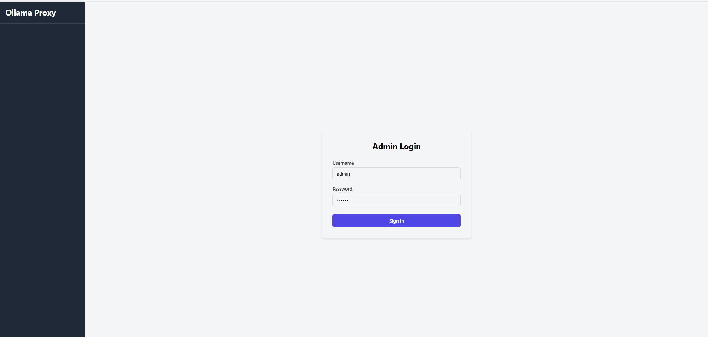
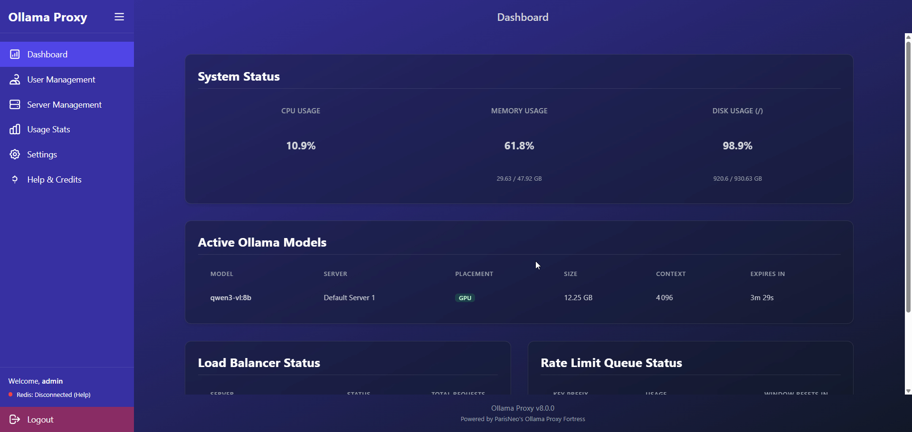
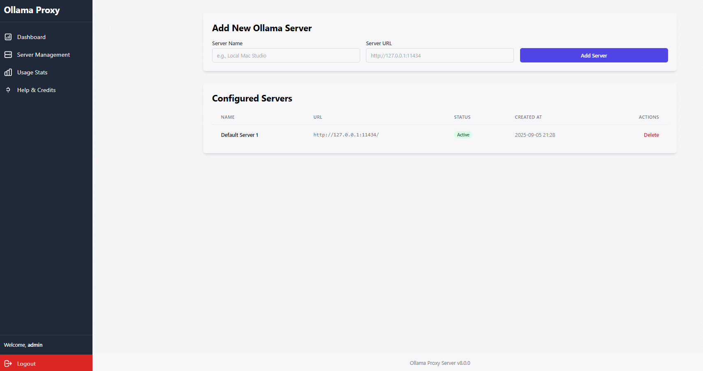
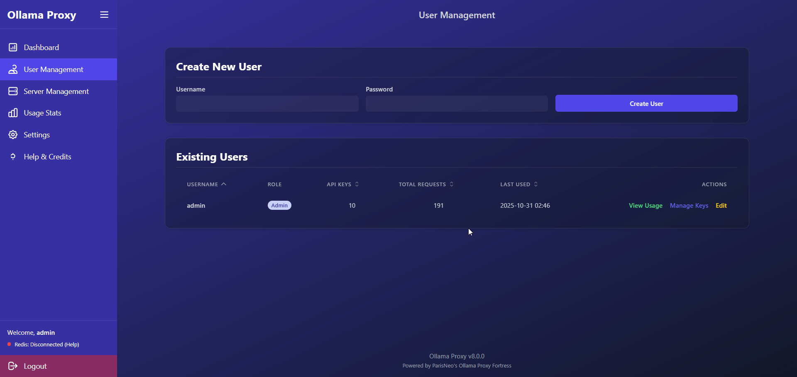
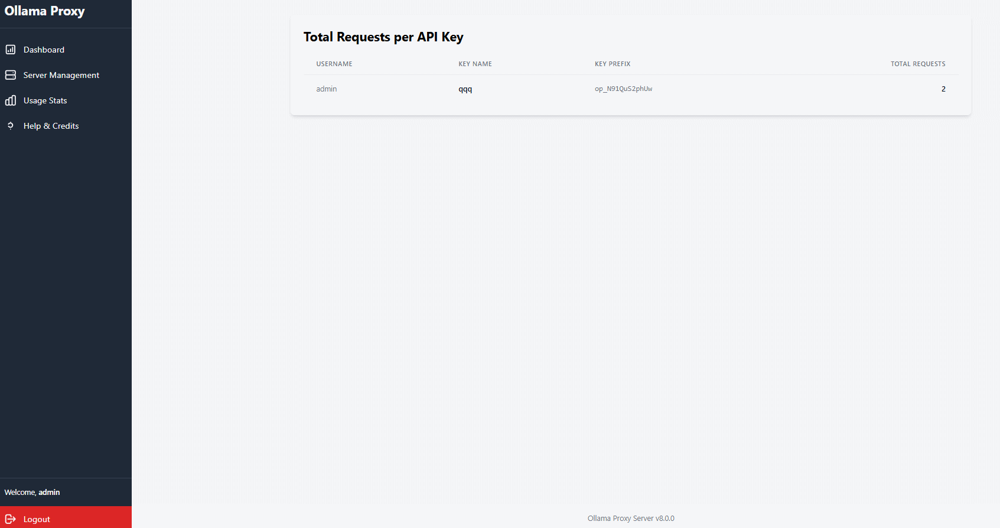
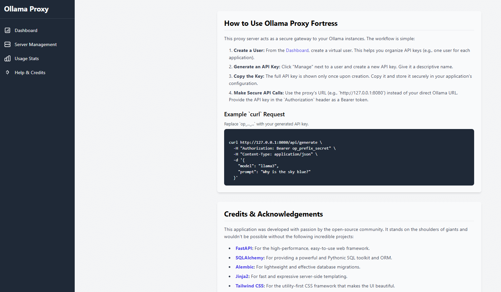

## 🧠 Advanced AI Orchestration: Routers & Ensembles

### Smart Routers: Hierarchical Model Routing

Create virtual "traffic controllers" that intelligently route requests to the best model for the job:

**Routing Strategies:**
- **Priority:** Always try the first model, fall back to second if unavailable
- **Random:** Even distribution for large clusters  
- **Least Loaded:** Route to the backend with lowest active request count (best for high-TPS apps)

**Decision Rules (Evaluated Top-to-Bottom):**
- **Fast Rules:** Keywords, regex patterns, message length, image detection, specific users
- **Semantic Rules:** Use a small LLM to classify intent when pattern matching isn't enough

**Example - Vision-Enabled Router:**
```
User Request: "What's in this image?" [attached photo]
↓
Rule: has_images = true → Route to gemma3:27b (VLM)
↓
VLM analyzes image → "A golden retriever playing fetch"
↓
Description + original prompt → Sent to llama3.1:70b (powerful text model)
```

### Ensemble Orchestrators (MoE)

Combine multiple models in parallel to create superior reasoning:

**Flow:**
```
User Query: "Analyze this contract for risks"
↓
Parallel Execution:
├─ Contract-Law-Agent → "Clause 3 is non-standard"
├─ Case-Law-Agent → "Similar to Smith v. Jones (2019)"
└─ Compliance-Agent → "GDPR Article 17 may apply"
↓
Master Model Synthesizes:
"Based on expert analysis: The non-standard clause (3) resembles 
Smith v. Jones where it was upheld. However, GDPR compliance 
requires additional safeguards. Recommendation:..."
```

### Quick Vision Enabler

The fastest way to give your text-only models vision capabilities:

**Before:** Your powerful 70B text model can't see images 😢
**After:** Create a vision router in 10 seconds ✅

1. Select your text model (e.g., `nemotron-3-super`)
2. Select a vision model (e.g., `gemma3:27b`)
3. Name it (e.g., `smart-vision-assistant`)
4. Done! Use `smart-vision-assistant` as any model name

---

## 🔒 Encrypt Everything with One-Click HTTPS/SSL

Securing your AI traffic is now dead simple. In the **Settings -> HTTPS/SSL** menu, you have two easy options:

1.  **Upload & Go (Easiest):** Simply upload your `key.pem` and `cert.pem` files directly through the UI. The hub handles the rest.
2.  **Path-Based:** If your certificates are already on the server (e.g., managed by Certbot), just provide the full file paths.

A server restart is required to apply changes, ensuring your connection is fully encrypted and secure from eavesdropping.

---

## Get Started in 60 Seconds (Yes, Really!)

### 1. Download the Project

Download the source code from the repository, either by using `git` or by downloading the ZIP file and extracting it.

```bash
git clone https://github.com/ParisNeo/lollms_hub.git
cd lollms_hub
```

### 2. Run the Installer

Based on your operating system, run the appropriate script. The first time you run it, it will guide you through a simple setup wizard.

**On Windows:**
Simply double-click `run_windows.bat`.

**On macOS or Linux:**
Open your terminal, navigate to the project folder, and run:
```bash
chmod +x run.sh
./run.sh
```

**That's it!** The hub is now running. To stop it, just close the terminal window or press `Ctrl+C`.

---

## Visual Showcase

### Step 1: Secure Admin Login

Log in with the secure credentials you created during setup.



### Step 2: The Command Center Dashboard

Your new mission control. Instantly see system health, active models, server status, and live rate-limit queues, all updating automatically.



### Step 3: Manage Your Servers & Models

No more SSH or terminal juggling. Add all your Ollama instances to the hub, then pull, update, and delete models on any server with a few clicks.



### Step 4: Choose Your Look: The Theming Engine

Navigate to the Settings page and instantly transform the entire UI. Pick a style that matches your mood or your desktop setup.


### Step 5: Manage Users & Drill Down into Analytics

The User Management page gives you a sortable, high-level overview. From here, click "View Usage" to dive into a dedicated analytics page for any specific user.



### Step 6: Create Intelligent Model Orchestration

Navigate to **Smart Routers** to build hierarchical routing logic. Create a vision enabler in seconds: select a text model + VLM, name it, and instantly give your text-only AI image understanding.

Or go to **Ensembles** to build Mixture-of-Experts pipelines. Define multiple parallel agents and a master synthesizer for complex reasoning tasks.

### Step 6: Create Intelligent Model Orchestration

Navigate to **Smart Routers** to build hierarchical routing logic. Create a vision enabler in seconds: select a text model + VLM, name it, and instantly give your text-only AI image understanding.

Or go to **Ensembles** to build Mixture-of-Experts pipelines. Define multiple parallel agents and a master synthesizer for complex reasoning tasks.

### Step 7: Test & Benchmark in the Playgrounds

Use the built-in playgrounds to evaluate your models. The **Chat Playground** provides a familiar UI to test conversational models with streaming and image support. The **Embedding Playground** lets you visualize and benchmark how different models understand semantic relationships using powerful 2D plots.

### Step 8: Master Your Analytics

The main "Usage Stats" page and the per-user pages give you a beautiful, exportable overview of exactly how your models are being used.



### Step 8: Get Help When You Need It

The built-in Help page is now a rich document with a sticky table of contents that tracks your scroll position, making it effortless to find the information you need.



---

## For the Power Users: Docker Deployment

If you prefer a container-based workflow, we've got you covered.

**1. Build the Docker image:**
```bash
docker build -t lollms-hub .
```

**2. Run the container:**
Create a `.env` file on your host machine, then run:
```bash
docker run -d --name lollms-hub \
  -p 8080:8080 \
  --env-file ./.env \
  -v ./lollms_hub.db:/home/app/lollms_hub.db \
  -v ./.ssl:/home/app/.ssl \
  -v ./app/static/uploads:/home/app/app/static/uploads \
  lollms-hub
```
*Note the extra volume mounts for the database, SSL files, and user uploads to persist data outside the container.*

---

## Resetting Your Installation (Troubleshooting)

> **WARNING: IRREVERSIBLE ACTION**
>
> The reset scripts are for troubleshooting or starting over completely. They will **PERMANENTLY DELETE** your database, configuration, and Python environment.

If you encounter critical errors or wish to perform a completely fresh installation, use the provided reset scripts.

**On Windows:**
Double-click the `reset.bat` file.

**On macOS or Linux:**
```bash
chmod +x reset.sh
./reset.sh
```

---

## Credits and Acknowledgements

This application was developed with passion by the open-source community. A special thank you to:

*   **ParisNeo** for creating and maintaining this project.
*   All contributors who have helped find and fix bugs.
*   The teams behind **FastAPI**, **SQLAlchemy**, **Jinja2**, **Chart.js**, and **Tailwind CSS**.

Visit the project on [GitHub](https://github.com/ParisNeo/lollms_hub) to contribute, report issues, or star the repository!

---

## License

This project is licensed under the Apache License 2.0. Feel free to use, modify, and distribute.