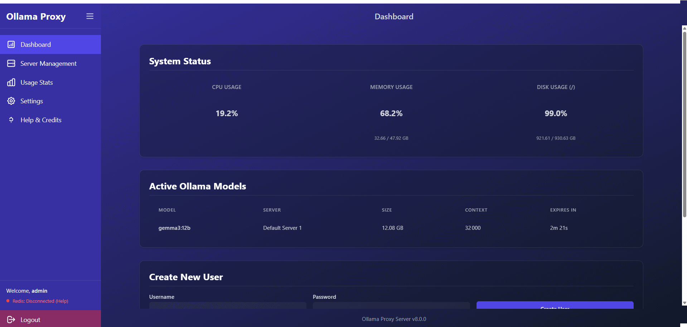

# Ollama Proxy Fortress: Your Personal AI Security Gateway 🛡️

[](https://opensource.org/licenses/Apache-2.0)


[](https://github.com/ParisNeo/ollama_proxy_server/stargazers/)

Stop exposing your local AI to the world. **Ollama Proxy Fortress** is the ultimate security and management layer for your Ollama instances, designed to be set up in **60 seconds** by anyone, on any operating system.

Whether you're a developer, a researcher, or just an AI enthusiast running models on your personal machine, this tool transforms your setup from a vulnerable open port into a managed, secure, and powerful AI hub.

---

## The Threat: Why Your PC Could Be at Risk

Last year, a critical vulnerability named **"Probllama" (CVE-2024-37032)** was discovered in Ollama. This wasn't a minor bug; it was a **Remote Code Execution (RCE)** vulnerability.

**What does that mean in plain English?** It means an attacker from anywhere on the internet could have sent a malicious request to your Ollama server and potentially:
*   💻 **Take full control of your computer.**
*   훔 **Steal your personal files, documents, and private keys.**
*   🗑️ **Delete your data or install ransomware.**
*   🤫 **Use your computer for malicious activities without your knowledge.**

While the core Ollama team impressively patched this vulnerability, the incident highlighted a crucial need for a dedicated security layer. Running an AI model should not mean opening a backdoor to your digital life.

### So, Why Do You Still Need This?

Ollama Proxy Fortress is **more than just a patch**. It's a permanent solution that offers layers of security and powerful features that core Ollama doesn't provide:

*   🛡️ **Ironclad Security Gateway:** Enforce API key authentication for every single request. Add global rate limiting to prevent abuse and filter access by IP address.
*   👤 **Centralized User Management:** Create different "users" for your different apps or family members, each with their own unique API keys.
*   🔑 **Fine-Grained Key Controls:** Set optional, **per-key rate limits** (e.g., 100 requests every 5 minutes) that override the global settings. Temporarily **disable or re-enable keys** on the fly without having to revoke them permanently.
*   🌐 **Multi-Server Management & Federation:** Centrally manage all your Ollama backend servers. The proxy load-balances requests and provides a unified view of all available models.
*   📊 **Graphical Usage Insights:** A beautiful analytics dashboard with interactive charts shows you usage over time, peak hours, and server load distribution, with options to export data.
*   🚀 **Effortless 1-Click Setup:** No Docker, no `pip install`, no command-line wizardry required. Just download and run a single script.

---

## Get Started in 60 Seconds (Yes, Really!)

This is the easiest way to secure your AI setup, period.

### 1. Download the Project

Download the source code from the repository, either by using `git` or by downloading the ZIP file and extracting it.

```bash
git clone https://github.com/ParisNeo/ollama_proxy_server.git
cd ollama_proxy_server
```

### 2. Run the Installer

Based on your operating system, run the appropriate script. The first time you run it, it will guide you through a simple setup wizard. The database is created automatically when the server starts.

**On Windows:**
Simply double-click `run_windows.bat`.

**On macOS or Linux:**
Open your terminal, navigate to the project folder, and run:
```bash
chmod +x run.sh
./run.sh
```

**That's it!** The server is now running. To stop it, just close the terminal window or press `Ctrl+C`.

---

## Visual Walkthrough & Features

### Step 1: Secure Admin Login

Once the server is running, go to the admin panel (e.g., `http://127.0.0.1:8080/admin`). Log in with the secure credentials you created during setup.


### Step 2: Manage Users and API Keys

The main dashboard is your central hub for creating virtual users. Click "Manage" to access the user details page where you can create, view, **enable/disable**, and revoke keys. You can also set **custom rate limits** for each new key, overriding the global settings.



### Step 3: Centrally Manage Ollama Servers

The "Server Management" page lets you add and remove all your backend Ollama instances. The proxy will load-balance requests across all active servers, and the `/api/tags` endpoint will show a federated list of models from all of them.


### Step 4: Monitor Usage Statistics

The "Usage Stats" page features interactive charts showing requests per day, peak usage hours, and server load distribution. All data and charts can be exported for reports.


### Step 5: Make Secure API Calls

Configure your applications to use the proxy URL and provide the API key as a Bearer token in the `Authorization` header. Your underlying Ollama server is now completely shielded from direct access.

```bash
curl http://127.0.0.1:8080/api/generate \
  -H "Content-Type: application/json" \
  -H "Authorization: Bearer op_prefix_secret" \
  -d '{
    "model": "llama3",
    "prompt": "Why is the sky blue?"
  }'
```

### Step 6: Get Help When You Need It

The built-in "Help & Credits" page provides a quick-start guide, code examples, and acknowledges the open-source projects that make this application possible.


---

## For the Power Users: Docker Deployment

If you prefer a container-based workflow, we've got you covered.

**1. Build the Docker image:**
```bash
docker build -t ollama-proxy-server .
```

**2. Run the container:**
Create a `.env` file on your host machine, then run:
```bash
docker run -d --name ollama-proxy \
  -p 8080:8080 \
  --env-file ./.env \
  -v ./ollama_proxy.db:/home/app/ollama_proxy.db \
  ollama-proxy-server
```

---

## Resetting Your Installation (Troubleshooting)

> **WARNING: IRREVERSIBLE ACTION**
>
> The reset scripts are for troubleshooting or starting over completely. They will **PERMANENTLY DELETE** your database, configuration, and Python environment. All users, API keys, and settings will be lost. Use with extreme caution.

If you encounter critical errors or wish to perform a completely fresh installation, you can use the provided reset scripts. You will be asked for confirmation before any files are deleted.

**On Windows:**
Simply double-click the `reset.bat` file and follow the on-screen instructions.

**On macOS or Linux:**
Open your terminal and run the following commands:
```bash
chmod +x reset.sh
./reset.sh
```

After the reset is complete, you can run the `run.sh` or `run_windows.bat` script again to perform a new installation.

---

## Credits and Acknowledgements

This application was developed with passion by the open-source community and stands on the shoulders of giants. A special thank you to:

*   **ParisNeo** for creating and maintaining this project.
*   All the contributors who notified about bugs in previous versions and for some of them contributed with actual bug fix code (take a look at the full contributors list for details).
*   The teams behind **FastAPI**, **SQLAlchemy**, **Jinja2**, **Chart.js**, and **Tailwind CSS** for their incredible open-source tools.

Visit the project on [GitHub](https://github.com/ParisNeo/ollama_proxy_server) to contribute, report issues, or star the repository!

---

## License

This project is licensed under the Apache License 2.0. Feel free to use, modify, and distribute.
