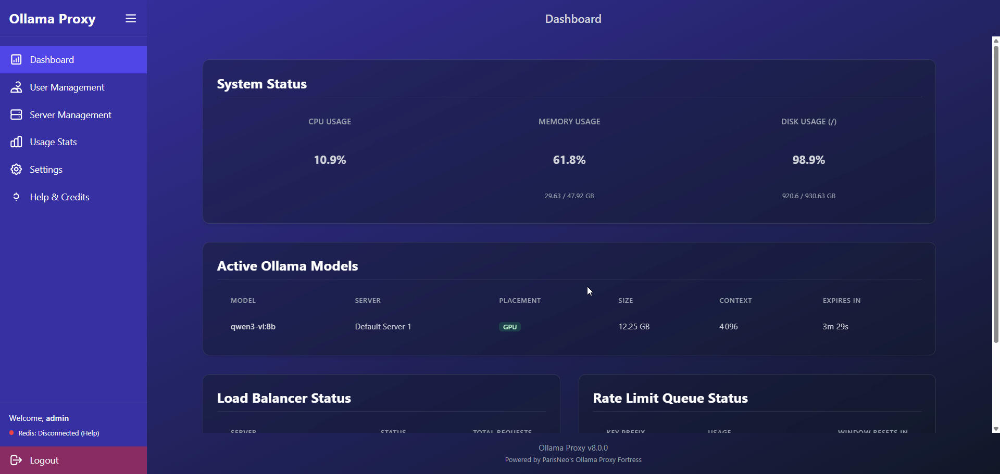
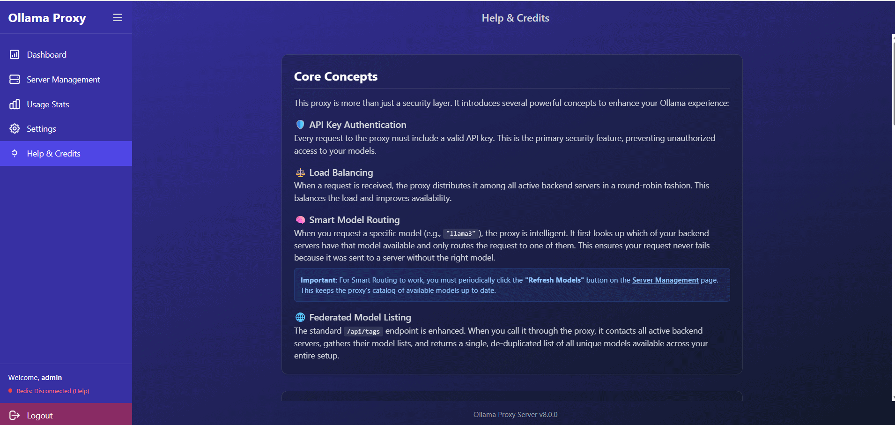

# Ollama Proxy Fortress: Your Personal AI Security Gateway 🛡️

[](https://opensource.org/licenses/Apache-2.0)


[](https://github.com/ParisNeo/ollama_proxy_server/stargazers/)

Stop exposing your local AI to the world. **Ollama Proxy Fortress** is the ultimate security and management layer for your Ollama instances, designed to be set up in **60 seconds** by anyone, on any operating system.

Whether you're a developer, a researcher, or just an AI enthusiast, this tool transforms your vulnerable open port into a managed, secure, and **deeply customizable** AI command center.

---

## The Threat: Why Your PC Could Be at Risk

A critical vulnerability named **"Probllama" (CVE-2024-37032)** was discovered in Ollama, allowing Remote Code Execution (RCE). In plain English, an attacker could have sent a malicious request to your Ollama server and **taken full control of your computer**—stealing files, installing ransomware, or using your machine for malicious activities.

While the core team patched this, the incident highlighted a crucial need for a dedicated security layer. Running an AI model should not mean opening a backdoor to your digital life.

### So, Why Do You Still Need This?

Ollama Proxy Fortress is **more than just a patch**. It's a permanent solution that unleashes a suite of powerful, enterprise-grade features that core Ollama doesn't provide:

*   ✨ **Centralized Model Management:** Pull, update, and delete models on any of your connected Ollama servers directly from the proxy's web UI. No more terminal commands or switching between machines.

*   🛡️ **Rock-Solid Security:**
    *   **Endpoint Blocking:** Prevent API key holders from accessing sensitive endpoints like `pull`, `delete`, and `create` to protect your servers from abuse.
    *   **API Key Authentication:** Eliminate anonymous access entirely.
    *   **One-Click HTTPS/SSL:** Encrypt all traffic with easy certificate uploads or path-based configuration.
    *   **IP Filtering:** Create granular allow/deny lists to control exactly which machines can connect.
    *   **Rate Limiting & Brute-Force Protection:** Prevent abuse and secure your admin login (powered by Redis).

*   🚀 **High-Performance Engine:**
    *   **Intelligent Load Balancing:** Distribute requests across multiple Ollama servers for maximum speed and high availability.
    *   **Smart Model Routing:** Automatically sends requests only to servers that have the specific model available, preventing failed requests and saving compute resources.
    *   **Automatic Retries:** The proxy resiliently handles temporary server hiccups with an exponential backoff strategy, making your AI services more reliable.

*   🧪 **Model Playgrounds & Benchmarking:**
    *   **Interactive Chat Playground:** Go beyond simple API calls. Chat with any model in a familiar interface that supports streaming, multi-modal inputs (paste images directly!), and full conversation history management (import/export).
    *   **Advanced Embedding Playground:** A powerful tool for data scientists and developers. Visualize how different embedding models "understand" language by plotting concepts in a 2D space. Use pre-built benchmarks or create your own to compare model performance side-by-side.

*   📊 **Mission Control Dashboard:**
    *   Go beyond `ollama ps`. Get a real-time, auto-updating view of your proxy's health (CPU, Memory, Disk), see all active models across all servers, monitor the **live health of your load balancer**, and watch API rate-limit queues fill and reset in real-time.

*   📈 **Comprehensive Analytics Suite:**
    *   Don't just guess your usage—know it. Dive into beautiful, interactive charts for daily and hourly requests, model popularity, and server load.
    *   With a single click, drill down into **per-user analytics** to understand individual usage patterns. All data is exportable to CSV or PNG.

*   🎨 **Radical Theming Engine:**
    *   Why should your tools be boring? Choose from over a dozen stunning UI themes to match your personal aesthetic. Whether you prefer a sleek **Material Design**, a futuristic **Cyberpunk** neon glow, a retro **CRT Terminal**, or a stark **Brutalist** look, you can make the interface truly yours.

*   👤 **Granular User & API Key Management:**
    *   Effortlessly create and manage users. The sortable user table gives you at-a-glance stats on key counts, total requests, and last activity.
    *   From there, manage individual API keys with per-key rate limits, and temporarily disable or re-enable keys on the fly.

*   🌐 **Multi-Server Management & Federation:**
    *   Centrally manage all your Ollama backend servers. The proxy load-balances requests and provides a unified, federated view of all available models from all your instances combined.

*   🌐 **Intelligent Web Search:**
    *   **SearXNG Integration:** Self-hosted, privacy-respecting metasearch engine with no rate limits. Aggregates results from multiple search engines for comprehensive answers.
    *   **Ollama Cloud Fallback:** Automatic fallback to Ollama's cloud search service if SearXNG is unavailable.
    *   **Smart Decision Matrix:** Automatically determines when queries need live internet data vs. using model knowledge.
    *   **Manual Toggle:** Control web search on/off in the chat playground with a single click.

*   ✨ **Effortless 1-Click Setup:**
    *   No Docker, no `pip install`, no command-line wizardry required. Just download and run a single script.

---

## 🛡️ Harden Your Defenses: Endpoint Blocking

Giving every user an API key shouldn't mean giving them the keys to the kingdom. By default, **Ollama Proxy Fortress blocks access to dangerous and resource-intensive API endpoints** for all API key holders.

-   **Prevent Denial-of-Service:** Stop users from triggering massive model downloads (`/api/pull`) that can saturate your network and fill your disk.
-   **Protect Your Models:** Prevent API users from deleting (`/api/delete`), copying (`/api/copy`), or creating (`/api/create`) models on your backend servers.
-   **Full Admin Control:** As an administrator, you can still perform all these actions securely through the web UI's **Model Management** page.
-   **Customizable:** You have full control to change which endpoints are blocked via the **Settings -> Endpoint Security** menu.

---

## 🔒 Encrypt Everything with One-Click HTTPS/SSL

Securing your AI traffic is now dead simple. In the **Settings -> HTTPS/SSL** menu, you have two easy options:

1.  **Upload & Go (Easiest):** Simply upload your `key.pem` and `cert.pem` files directly through the UI. The server handles the rest.
2.  **Path-Based:** If your certificates are already on the server (e.g., managed by Certbot), just provide the full file paths.

A server restart is required to apply changes, ensuring your connection is fully encrypted and secure from eavesdropping.

---

## Get Started in 60 Seconds (Yes, Really!)

### 1. Download the Project

Download the source code from the repository, either by using `git` or by downloading the ZIP file and extracting it.

```bash
git clone https://github.com/ParisNeo/ollama_proxy_server.git
cd ollama_proxy_server
```

### 2. Run the Installer

Based on your operating system, run the appropriate script. The first time you run it, it will guide you through a simple setup wizard.

**On Windows:**
Simply double-click `run_windows.bat`.

**On macOS or Linux:**
Open your terminal, navigate to the project folder, and run:
```bash
chmod +x run.sh
./run.sh
```

**That's it!** The server is now running. To stop it, just close the terminal window or press `Ctrl+C`.

---

## Visual Showcase

### Step 1: Secure Admin Login

Log in with the secure credentials you created during setup.


### Step 2: The Command Center Dashboard

Your new mission control. Instantly see system health, active models, server status, and live rate-limit queues, all updating automatically.



*Static view of the dashboard showing real-time system metrics:*


### Step 3: Manage Your Servers & Models

No more SSH or terminal juggling. Add all your Ollama instances, then pull, update, and delete models on any server with a few clicks.


### Step 4: Choose Your Look: The Theming Engine

Navigate to the Settings page and instantly transform the entire UI. Pick a style that matches your mood or your desktop setup.


### Step 5: Manage Users & Drill Down into Analytics

The User Management page gives you a sortable, high-level overview. From here, click "View Usage" to dive into a dedicated analytics page for any specific user.


### Step 6: Test & Benchmark in the Playgrounds

Use the built-in playgrounds to evaluate your models. The **Chat Playground** provides a familiar UI to test conversational models with streaming and image support. Toggle web search on/off with a single click to enable real-time internet data for your queries. The **Embedding Playground** lets you visualize and benchmark how different models understand semantic relationships using powerful 2D plots.


### Step 7: Master Your Analytics

The main "Usage Stats" page and the per-user pages give you a beautiful, exportable overview of exactly how your models are being used.


### Step 8: Get Help When You Need It

The built-in Help page is now a rich document with a sticky table of contents that tracks your scroll position, making it effortless to find the information you need.



---

## 🌐 Web Search Integration: SearXNG & Ollama Cloud

The proxy server includes intelligent web search capabilities that enhance AI responses with real-time information from the internet.


### How It Works

The proxy uses a **dual-search architecture**:

1. **Primary: SearXNG** (Privacy-respecting metasearch engine)
   - Self-hosted, no rate limits
   - Aggregates results from multiple search engines
   - Fully private - no tracking or data collection
   - Default URL: `http://localhost:7019`

2. **Fallback: Ollama Cloud Search**
   - Used automatically if SearXNG is unavailable
   - Requires an Ollama API key (free tier available)
   - Has rate limits based on your tier

### Setting Up SearXNG (Recommended)

**Option 1: Using Docker with Caddy (Recommended)**

If you have SearXNG running via Caddy on port 7019 (as shown in the `Caddyfile`), simply configure it in your `.env`:

```bash
SEARXNG_URL=http://localhost:7019
```

**Option 2: Standalone SearXNG Installation**

1. Install SearXNG following the [official guide](https://docs.searxng.org/admin/installation.html)
2. Configure it to run on port 7019 (or your preferred port)
3. Update your `.env` file:
   ```bash
   SEARXNG_URL=http://localhost:7019
   ```

**Option 3: Ollama Cloud Only (Simpler Setup)**

If you prefer not to run SearXNG, you can use Ollama cloud search exclusively:

1. Get your Ollama API key from [https://ollama.com/settings/keys](https://ollama.com/settings/keys)
2. Add to your `.env`:
   ```bash
   OLLAMA_API_KEY=your_key_here
   ```
3. Leave `SEARXNG_URL` empty or unset

### Using Web Search

**In the Chat Playground:**
- Toggle the "Web Search" button in the header
- When enabled, the system automatically determines if a query needs live internet data
- The decision matrix analyzes your question and only searches when necessary

**In API Requests:**
- Web search is automatically enabled for proxy requests when `enable_proxy_web_search` is enabled in settings
- The system intelligently detects queries that need current information

**Manual Search Endpoint:**
- Visit `/search?q=your+query` in your browser
- Or use the JSON API: `/api/v1/search?q=your+query&format=json`
- Toggle between engines: `?engine=searxng` or `?engine=ollama`

### Configuration

All web search settings can be configured in the admin dashboard:
- **Settings → Web Search**: Enable/disable proxy-wide web search
- **Settings → Ollama API Keys**: Configure your Ollama cloud search keys
- **Settings → SearXNG URL**: Set your local SearXNG instance URL

For detailed configuration options, see `.env.example`.

---

## For the Power Users: Docker Deployment

If you prefer a container-based workflow, we've got you covered.

**1. Build the Docker image:**
```bash
docker build -t ollama-proxy-server .
```

**2. Run the container:**
Create a `.env` file on your host machine, then run:
```bash
docker run -d --name ollama-proxy \
  -p 8080:8080 \
  --env-file ./.env \
  -v ./ollama_proxy.db:/home/app/ollama_proxy.db \
  -v ./.ssl:/home/app/.ssl \
  -v ./app/static/uploads:/home/app/app/static/uploads \
  ollama-proxy-server
```
*Note the extra volume mounts for the database, SSL files, and user uploads to persist data outside the container.*

---

## Resetting Your Installation (Troubleshooting)

> **WARNING: IRREVERSIBLE ACTION**
>
> The reset scripts are for troubleshooting or starting over completely. They will **PERMANENTLY DELETE** your database, configuration, and Python environment.

If you encounter critical errors or wish to perform a completely fresh installation, use the provided reset scripts.

**On Windows:**
Double-click the `reset.bat` file.

**On macOS or Linux:**
```bash
chmod +x reset.sh
./reset.sh
```

---

## ⚠️ OpenAI-Compatible Endpoints (Experimental/Incomplete)

**Status**: OpenAI-compatible endpoints have been implemented but are **not fully tested or complete**. Use at your own risk.

The proxy server includes basic OpenAI-compatible endpoints for compatibility with clients like MSTY:

- **`GET /v1/models`** and **`GET /models`** - List available models
- **`POST /v1/chat/completions`** and **`POST /chat/completions`** - Chat completions (with streaming support)
- **`POST /v1/embeddings`** and **`POST /embeddings`** - Text embeddings
- **`POST /v1/completions`** and **`POST /completions`** - Legacy text completions (converted to chat)
- **`POST /v1/moderations`** and **`POST /moderations`** - Content moderation (returns safe defaults)

### Known Limitations

- Endpoints may not fully match OpenAI's API specification
- Some advanced features (function calling, tool use, etc.) may not work correctly
- Response formats may differ from OpenAI's exact format
- Error handling may not match OpenAI's error responses
- Token counting and usage statistics are approximations

### Recommendations

- **For production use**: Stick with the native Ollama API endpoints (`/api/*`)
- **For testing**: OpenAI endpoints can be used but should be thoroughly tested with your specific client
- **For MSTY**: These endpoints were added to support MSTY, but compatibility is not guaranteed

If you encounter issues with OpenAI-compatible endpoints, please report them, but note that these are lower priority than core Ollama proxy functionality.

---

## 🤖 Intelligent Auto-Routing System

The proxy includes a sophisticated auto-routing system that intelligently selects the best model for each request based on:

- **Request Analysis**: Automatically detects if your request needs images, code, tool calling, internet access, reasoning, or speed
- **Model Capabilities**: Matches requests to models with the right capabilities
- **Priority Modes**: Four modes (Free, Daily Drive, Advanced, Luxury) to match your budget and quality needs
- **Semantic Matching**: Uses AI-generated model descriptions to find the best fit
- **Smart Scoring**: Multi-factor scoring algorithm ensures optimal model selection


*Hover over the 💰 icon next to any model name to see detailed pricing information:*


### How It Works

When you send a request with `"model": "auto"`, the system:

1. **Analyzes your request** to determine what capabilities are needed
2. **Filters models** by priority level (based on your selected mode)
3. **Scores each model** based on capability matches, semantic similarity, and priority
4. **Selects the best model** and routes your request automatically

### Priority Modes

- **Free Mode**: Prioritizes free models first, then Ollama cloud, then paid
- **Daily Drive Mode**: Prioritizes Ollama cloud models first (great balance)
- **Advanced Mode**: Prioritizes top-tier paid models (Claude 4.5, GPT-5, Gemini 3)
- **Luxury Mode**: Prioritizes premium models ($5+/1M tokens) for high-budget scenarios


### Example Scenarios

**Code Request** → Automatically selects a code-specialized model (e.g., `deepseek-coder:free`)  
**Image Analysis** → Selects a vision-capable model (e.g., `gemini-2.5-pro:cloud`)  
**Tool Calling** → Selects a model with function calling support (e.g., `claude-4.5-sonnet`)  
**Internet Search** → Selects a model with web grounding (e.g., `gemini-3-pro:cloud`)  
**Reasoning Task** → Selects a thinking model (e.g., `o4-mini`)

For complete documentation, see [AUTO_ROUTING_DOCUMENTATION.md](AUTO_ROUTING_DOCUMENTATION.md).

---

## Credits and Acknowledgements

This application was developed with passion by the open-source community. A special thank you to:

*   **ParisNeo** for creating and maintaining this project.
*   All contributors who have helped find and fix bugs.
*   The teams behind **FastAPI**, **SQLAlchemy**, **Jinja2**, **Chart.js**, and **Tailwind CSS**.

Visit the project on [GitHub](https://github.com/ParisNeo/ollama_proxy_server) to contribute, report issues, or star the repository!

---

## License

This project is licensed under the Apache License 2.0. Feel free to use, modify, and distribute.
