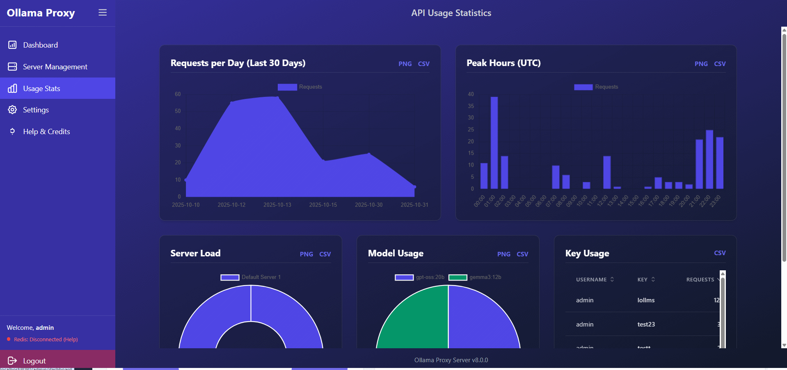

# Ollama Proxy Fortress: Your Personal AI Security Gateway 🛡️

[](https://opensource.org/licenses/Apache-2.0)


[](https://github.com/ParisNeo/ollama_proxy_server/stargazers/)

Stop exposing your local AI to the world. **Ollama Proxy Fortress** is the ultimate security and management layer for your Ollama instances, designed to be set up in **60 seconds** by anyone, on any operating system.

Whether you're a developer, a researcher, or just an AI enthusiast, this tool transforms your vulnerable open port into a managed, secure, and **deeply customizable** AI command center.

---

## The Threat: Why Your PC Could Be at Risk

A critical vulnerability named **"Probllama" (CVE-2024-37032)** was discovered in Ollama, allowing Remote Code Execution (RCE). In plain English, an attacker could have sent a malicious request to your Ollama server and **taken full control of your computer**—stealing files, installing ransomware, or using your machine for malicious activities.

While the core team patched this, the incident highlighted a crucial need for a dedicated security layer. Running an AI model should not mean opening a backdoor to your digital life.

### So, Why Do You Still Need This?

Ollama Proxy Fortress is **more than just a patch**. It's a permanent solution that unleashes a suite of powerful features that core Ollama doesn't provide:

*   🚀 **Hyper-Detailed Live Dashboard:** Go beyond `ollama ps`. Get a real-time, auto-updating view of your proxy's health (CPU, Memory, Disk), see all active models across all servers, monitor the **live health of your load balancer**, and watch API rate-limit queues fill and reset in real-time.

*   🎨 **Radical Theming Engine:** Why should your tools be boring? Choose from over a dozen stunning UI themes to match your personal aesthetic. Whether you prefer a sleek **Material Design**, a futuristic **Cyberpunk** neon glow, a retro **CRT Terminal**, or a stark **Brutalist** look, you can make the interface truly yours.

*   📈 **Comprehensive Analytics Suite:** Don't just guess your usage—know it. Dive into beautiful, interactive charts for daily and hourly requests, model popularity, and server load. Plus, with a single click, drill down into **per-user analytics** to understand individual usage patterns. All data is exportable.

*   👤 **Granular User & API Key Management:** Effortlessly create and manage users. The sortable user table gives you at-a-glance stats on key counts, total requests, and last activity. From there, manage individual API keys with per-key rate limits, and temporarily disable or re-enable keys on the fly.

*   🌐 **Multi-Server Management & Federation:** Centrally manage all your Ollama backend servers. The proxy load-balances requests and provides a unified, federated view of all available models from all your instances combined.

*   ✨ **Polished User Experience:** From a streamlined logo upload process to a rich, navigable Help page with a scroll-spying table of contents, every detail has been crafted to be intuitive and enjoyable to use.

*   🚀 **Effortless 1-Click Setup:** No Docker, no `pip install`, no command-line wizardry required. Just download and run a single script.

---

## Get Started in 60 Seconds (Yes, Really!)

This is the easiest way to secure your AI setup, period.

### 1. Download the Project

Download the source code from the repository, either by using `git` or by downloading the ZIP file and extracting it.

```bash
git clone https://github.com/ParisNeo/ollama_proxy_server.git
cd ollama_proxy_server
```

### 2. Run the Installer

Based on your operating system, run the appropriate script. The first time you run it, it will guide you through a simple setup wizard.

**On Windows:**
Simply double-click `run_windows.bat`.

**On macOS or Linux:**
Open your terminal, navigate to the project folder, and run:
```bash
chmod +x run.sh
./run.sh
```

**That's it!** The server is now running. To stop it, just close the terminal window or press `Ctrl+C`.

---

## Visual Showcase

### Step 1: Secure Admin Login

Log in with the secure credentials you created during setup.


### Step 2: The Command Center Dashboard

Your new mission control. Instantly see system health, active models, server status, and live rate-limit queues, all updating automatically.

*[GIF showcasing the new dashboard with its auto-updating System Status, Load Balancer health (servers going online/offline), and Rate Limit Queue progress bars filling up.]*

### Step 3: Choose Your Look: The Theming Engine

Navigate to the Settings page and instantly transform the entire UI. Pick a style that matches your mood or your desktop setup.

*[GIF rapidly cycling through various themes like Cyberpunk, Retro Terminal, Material Flat, Brutalism, and Aurora to show off the dramatic visual changes.]*

### Step 4: Manage Users & Drill Down into Analytics

The User Management page gives you a sortable, high-level overview. From here, click "View Usage" to dive into a dedicated analytics page for any specific user.

*[Image showing the user list with the "View Usage" button, perhaps with an arrow pointing to the new user-specific statistics page with its own set of charts.]*

### Step 5: Master Your Analytics

The main "Usage Stats" page and the per-user pages give you a beautiful, exportable overview of exactly how your models are being used.



### Step 6: Make Secure API Calls

Configure your applications to use the proxy URL and provide the API key. Your underlying Ollama server is now completely shielded.

```bash
curl http://127.0.0.1:8080/api/generate \
  -H "Content-Type: application/json" \
  -H "Authorization: Bearer op_prefix_secret" \
  -d '{
    "model": "llama3",
    "prompt": "Why is the sky blue?"
  }'
```

### Step 7: Get Help When You Need It

The built-in Help page is now a rich document with a sticky table of contents that tracks your scroll position, making it effortless to find the information you need.


---

## For the Power Users: Docker Deployment

If you prefer a container-based workflow, we've got you covered.

**1. Build the Docker image:**
```bash
docker build -t ollama-proxy-server .
```

**2. Run the container:**
Create a `.env` file on your host machine, then run:
```bash
docker run -d --name ollama-proxy \
  -p 8080:8080 \
  --env-file ./.env \
  -v ./ollama_proxy.db:/home/app/ollama_proxy.db \
  ollama-proxy-server
```

---

## Resetting Your Installation (Troubleshooting)

> **WARNING: IRREVERSIBLE ACTION**
>
> The reset scripts are for troubleshooting or starting over completely. They will **PERMANENTLY DELETE** your database, configuration, and Python environment.

If you encounter critical errors or wish to perform a completely fresh installation, use the provided reset scripts.

**On Windows:**
Double-click the `reset.bat` file.

**On macOS or Linux:**
```bash
chmod +x reset.sh
./reset.sh
```

---

## Credits and Acknowledgements

This application was developed with passion by the open-source community. A special thank you to:

*   **ParisNeo** for creating and maintaining this project.
*   All contributors who have helped find and fix bugs.
*   The teams behind **FastAPI**, **SQLAlchemy**, **Jinja2**, **Chart.js**, and **Tailwind CSS**.

Visit the project on [GitHub](https://github.com/ParisNeo/ollama_proxy_server) to contribute, report issues, or star the repository!

---

## License

This project is licensed under the Apache License 2.0. Feel free to use, modify, and distribute.